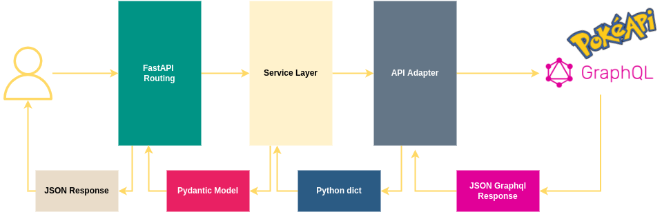

# Pokemon API
###### Author: Erick Samaniego
___

<!-- TOC -->
* [Pokemon API](#api) 
  * [Flow diagram](#flow-diagram)
    * [how it works?](#how-it-works)
  * [Execute tests:](#execute-tests-)
<!-- TOC -->

## Flow diagram
### how it works?



## Execute tests:

```shell
docker exec -ti pokemon_fastapi_api_1 pytest
```
